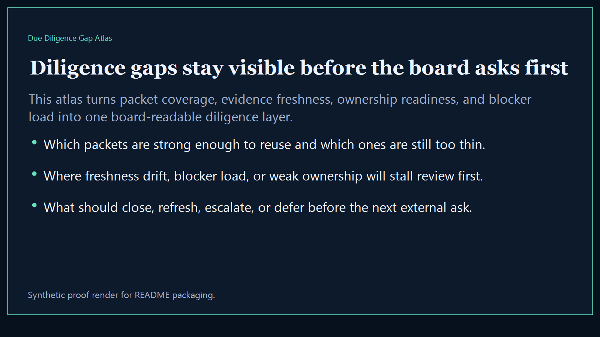
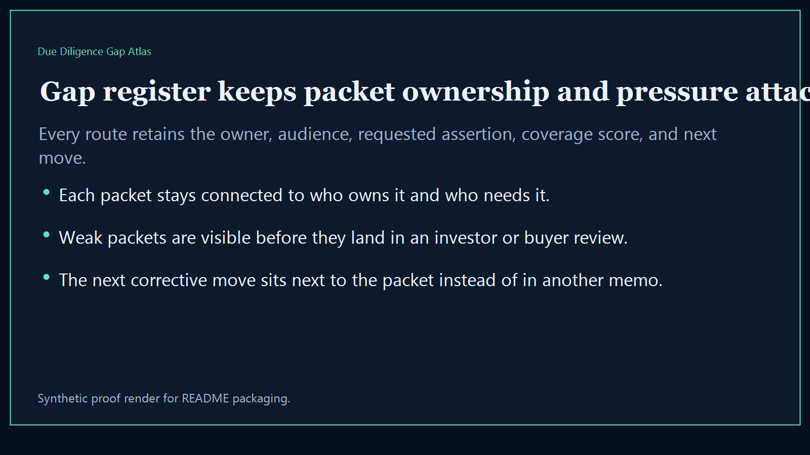
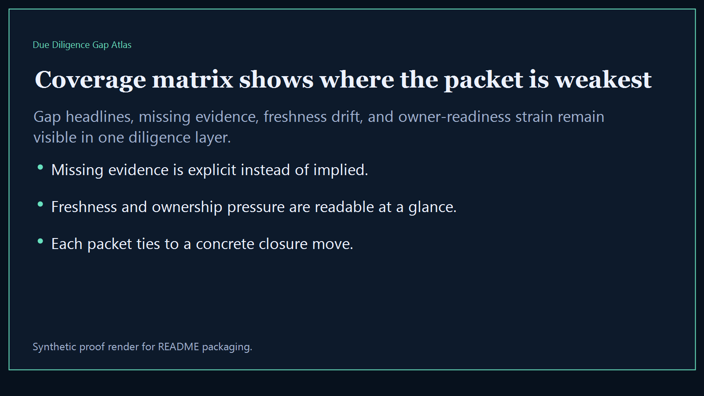
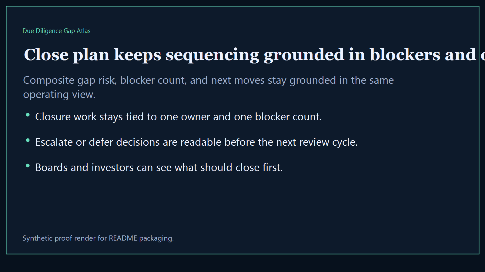

# Due Diligence Gap Atlas

Board-ready diligence surface for showing where investor, buyer, and partner packets are incomplete, which workstreams are blocking readiness, and what should be closed before the next external review.

- Live: `http://gaps.kineticgain.com/`
- Repo: `mizcausevic-dev/due-diligence-gap-atlas`

## Why this matters

Leaders need one diligence layer that shows which requests are fully covered, which packets are thin or stale, which owners are blocking readiness, and where the next review will stall first.

## What it includes

- TypeScript executive-intelligence surface for request coverage, evidence gaps, owner bottlenecks, freshness drift, and readiness posture
- synthetic diligence lanes across AI, identity, revenue, procurement, FinTech, and biotech
- reusable outputs for gap atlas, coverage matrix, close plan, and board-ready operating memos
- prerendered static site, JSON payloads, screenshots, and docs

## Routes

- `/`
- `/gap-register`
- `/coverage-matrix`
- `/close-plan`
- `/verification`
- `/docs`

## Local run

```bash
cd due-diligence-gap-atlas
npm install
npm run verify
npm run prerender
npm run render:assets
```

## CLI

```bash
npx due-diligence-gap-atlas fixtures/due-diligence-gap-atlas.json --format summary
npx due-diligence-gap-atlas fixtures/due-diligence-gap-atlas-clean.json --format json
```

## Docs

- [Architecture](docs/architecture.md)
- [Origin](docs/ORIGIN.md)
- [Kinetic Gain Embedded](docs/KINETIC_GAIN_EMBEDDED.md)

## Screenshots





